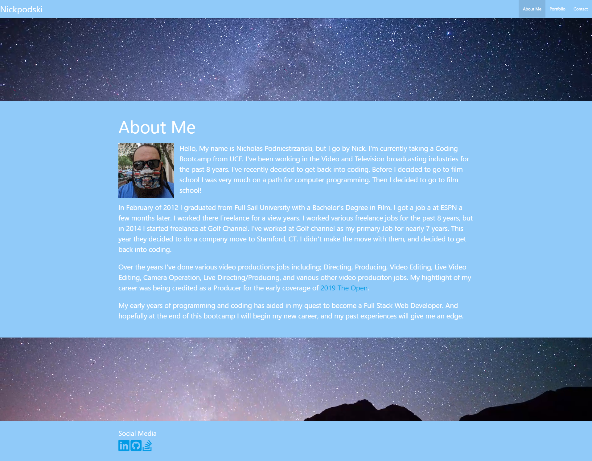
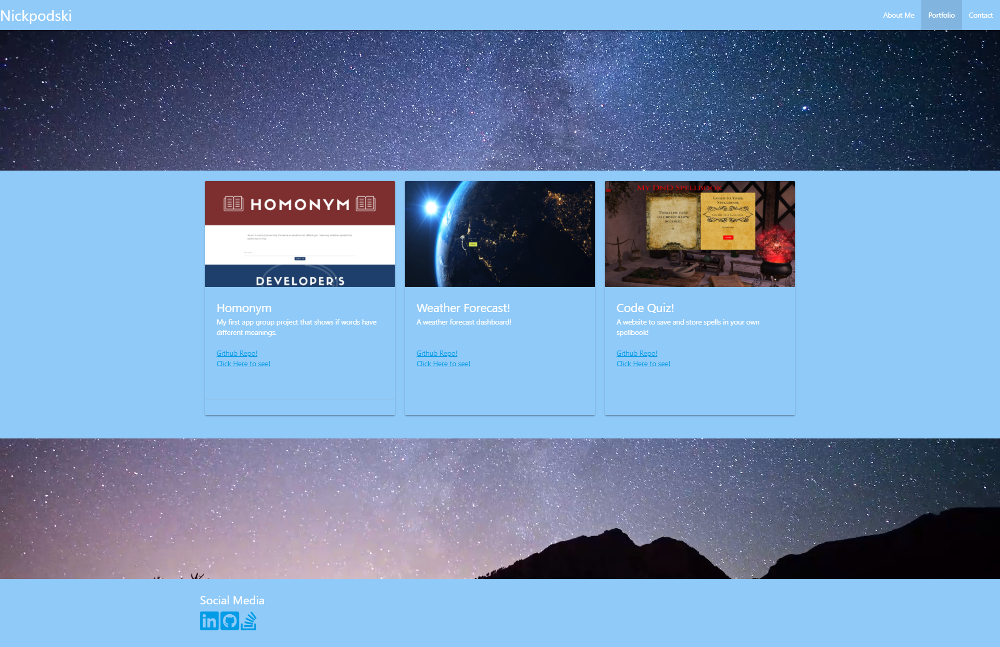

# Nickpodski_Portfolio

## Description

This is my updated portfolio page. It has an about me page, a page for links to 3 of my projects, and a page to contact me. You can also download my resume, and that bottom of the page is links to a few social media.

## Table of Contents

* [Screenshots](#screenshots)
* [Links](#links)
* [Credits](#credits)

## Screenshots

## Links

https://nickpodski.github.io/Portfolio_Nickpodski/ - Live URL
https://nickpodski.github.io/Portfolio_Nickpodski/portfolio.html - Portfolio Page
https://nickpodski.github.io/Portfolio_Nickpodski/contact.html - Contact Page
https://github.com/Nickpodski/Portfolio_Nickpodski - Github Repo

## Credits

https://materializecss.com/ - Materialize
https://www.w3schools.com/ - W3 Schools